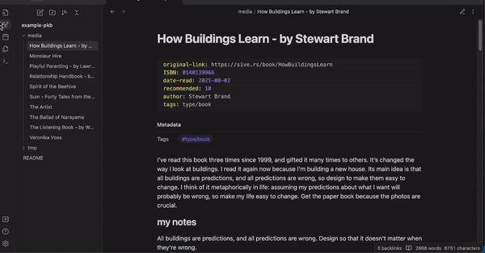

## Example Vault

To try out the library, you can use [this example vault](https://github.com/selimrbd/example-vault) containing book and movie reviews.

## Setup

First, create a `Notes` object by pointing to one of your vault's directories:

```python
from pathlib import Path
from pyomd import Notes, Note

path_dir = Path("/path/to/your/directory")
notes = Notes(path_dir)

## You can also create a single note object, if you only need to modify 1 note
# note = Note(path_dir)
```

## move metadata between frontmatter and inline

```python
notes.metadata.move(fr=MetadataType.FRONTMATTER, to=MetadataType.INLINE)
notes.update_content(inline_inplace=False, inline_position="top", inline_tml="standard") #type: ignore
notes.write()
```


## regroup inline metadata inside a callout

```python
notes.update_content(inline_inplace=False, inline_position="top", inline_tml="callout") #type: ignore
notes.write()
```


## add and remove metadata 
```python
notes.filter(has_meta=[("tags", "type/book", MetadataType.INLINE)])

notes.metadata.add(k="type", l="[[book]]", meta_type=MetadataType.INLINE)
notes.metadata.remove(k="tags", l="type/book", meta_type=MetadataType.INLINE)

notes.update_content(inline_inplace=False, inline_position="top", inline_tml="callout") #type: ignore
notes.write()
```

